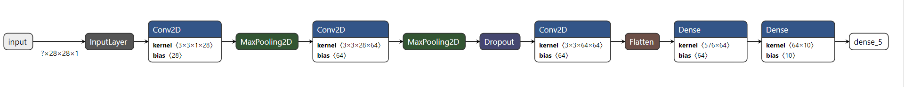

# Federated Learninig(FL) simulation
A Tutorial on how to use TFF framework is prepared [here](A_Tutorial_on_FL_API.ipynb) thanks great documentation of [TFF](https://www.tensorflow.org/federated).

**Installing Required Libraries**
you need to install tensorflow_federated inroder to run these simulations
```bash
    $ conda create -n fed python=3.8
    $ conda activate fed
    $ conda install jupyter notebook
    $ conda install tensorflow====2.3.2
    $ pip install tensorflow_federated
```
for GPU acceleration you need to download and install [cuda 10.1](https://developer.nvidia.com/cuda-10.1-download-archive-base) and [cudnn-11.0](https://developer.nvidia.com/rdp/cudnn-archive) and add them to your path environment variable.
		you may want to  use requrements.txt  by running the command below:
```bash
    $ pip install -r requirements.txt
```	


**Running Simulation**
After successful installation, you can run simulation using [`run_sim_fed`](run_sim_fed.ipynb) notebook.
This simulation comares accuray of a classifier nn model between a federated model and its equivalent central model.
structure of CNN nn is shown below (using [netron](https://github.com/lutzroeder/netron)).



